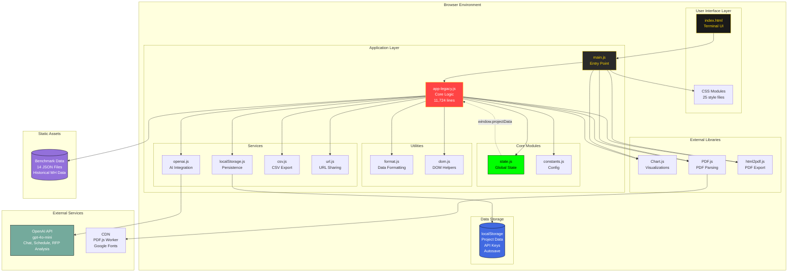
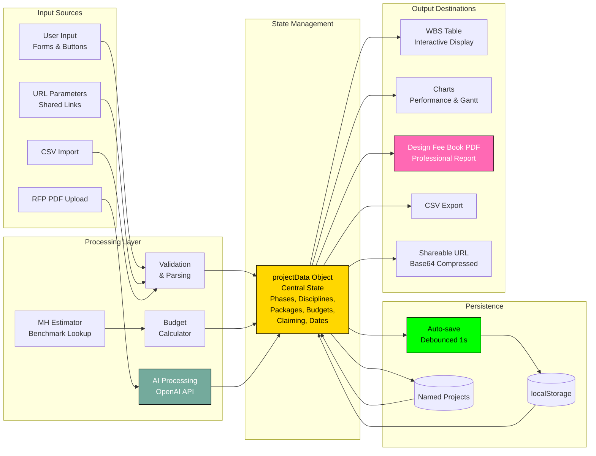
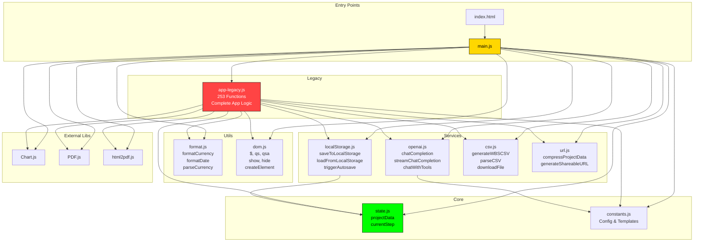
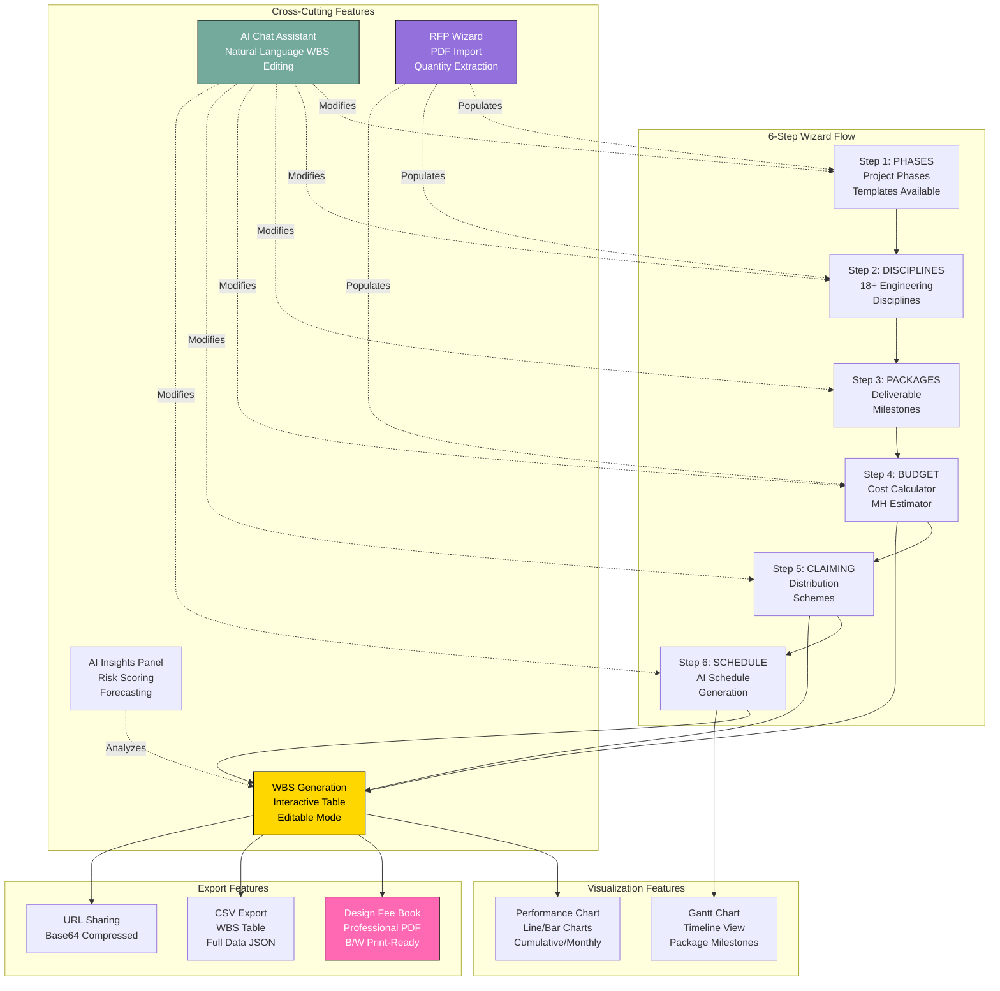
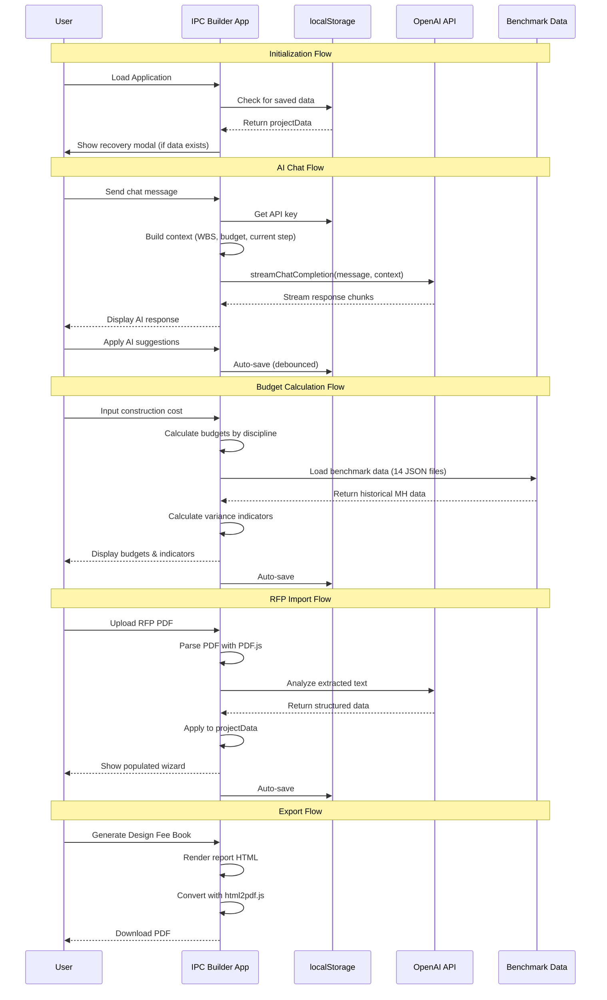
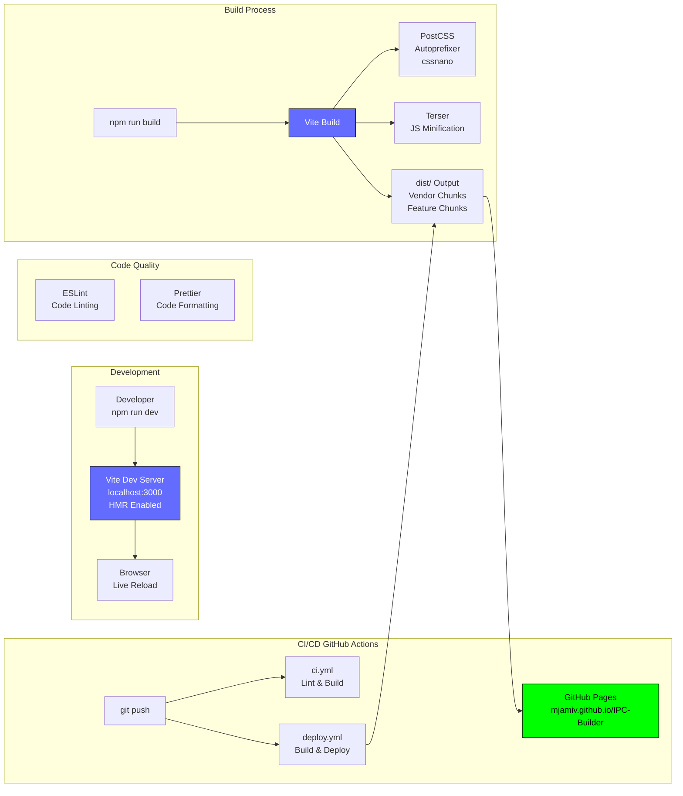
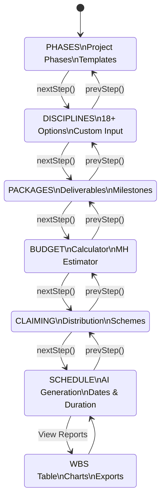

# IPC Builder - Architecture Diagram

This document provides visual network diagrams showing the architecture and data flow of the IPC Builder application.

## High-Level Architecture



## Data Flow Architecture



## Module Dependency Graph



## Feature Architecture



## State Object Structure

```mermaid
graph TD
    PD[projectData Object]

    PD --> Phases[phases: Array<br/>['Base', 'ESDC', 'TSCD']]
    PD --> Disciplines[disciplines: Array<br/>['Structures', 'Civil', 'Traffic']]
    PD --> Packages[packages: Array<br/>['Preliminary', 'Interim', 'Final']]
    PD --> Budgets[budgets: Object<br/>{discipline: amount}]
    PD --> Claiming[claiming: Object<br/>{discipline-package: percent}]
    PD --> Dates[dates: Object<br/>{discipline-package: {start, end}}]
    PD --> Calc[calculator: Object]
    PD --> Scope[projectScope: String]
    PD --> Notes[scheduleNotes: String]
    PD --> DScopes[disciplineScopes: Object]

    Calc --> TCC[totalConstructionCost: Number]
    Calc --> DFP[designFeePercent: Number]
    Calc --> PT[projectType: String]
    Calc --> TDF[totalDesignFee: Number]
    Calc --> CO[complexityOverrides: Object]
    Calc --> IC[isCalculated: Boolean]
    Calc --> ME[manualEdits: Object]

    style PD fill:#ffd700,stroke:#000,color:#000
    style Calc fill:#ff69b4,stroke:#000,color:#fff
```

## External API Integration



## Build & Deployment Pipeline



## Key Technologies

| Layer | Technology | Purpose |
|-------|-----------|---------|
| **Build** | Vite 5.x | Fast dev server, HMR, production bundling |
| **CSS** | PostCSS + Autoprefixer + cssnano | Browser compatibility, minification |
| **State** | Vanilla JS | Global `projectData` object |
| **Storage** | localStorage | Client-side persistence |
| **Charts** | Chart.js 4.x | Performance & financial charts |
| **PDF Parse** | PDF.js 3.11.174 | RFP import functionality |
| **PDF Export** | html2pdf.js 0.10.1 | Design Fee Book generation |
| **AI** | OpenAI gpt-4o-mini | Chat, scheduling, RFP analysis |
| **Deployment** | GitHub Pages | Static hosting |

## Data Storage Schema

```
localStorage
├── wbsTerminal_project (Auto-save)
│   ├── projectData: {...}
│   ├── formValues: {...}
│   └── currentStep: 1-6
│
├── wbsTerminal_projects (Named Projects)
│   └── Array<{name, timestamp, data}>
│
└── wbsTerminal_openai_key (API Key)
    └── String (encrypted)

public/data/benchmarking/
├── benchmarking-bridges.json
├── benchmarking-roadway.json
├── benchmarking-drainage.json
├── benchmarking-traffic.json
├── benchmarking-utilities.json
├── benchmarking-civil.json
├── benchmarking-structures.json
├── benchmarking-geotech.json
├── benchmarking-environmental.json
├── benchmarking-hydraulics.json
├── benchmarking-landscape.json
├── benchmarking-lighting.json
├── benchmarking-permitting.json
└── benchmarking-survey.json
```

## Navigation Flow



---

## Architecture Principles

### 1. **Gradual Migration Strategy**
- Legacy monolithic code (`app-legacy.js`) handles core business logic
- New modular services provide foundation for future refactoring
- `window.*` exports maintain backward compatibility

### 2. **Client-Side First**
- No server required - fully static deployment
- localStorage for persistence
- URL parameters for sharing

### 3. **Progressive Enhancement**
- Core functionality works without AI features
- AI key optional (stored in localStorage)
- Graceful degradation for missing features

### 4. **Terminal Aesthetic**
- JetBrains Mono font throughout
- Gold (#ffd700) on dark backgrounds
- Monospace, command-line inspired UI

### 5. **Performance Optimization**
- Vite code splitting (vendor chunks, feature chunks)
- CSS minification with cssnano
- Debounced auto-save (1000ms)
- Lazy loading of benchmark data

---

*This architecture diagram is auto-generated from codebase analysis. For implementation details, see individual module documentation.*
